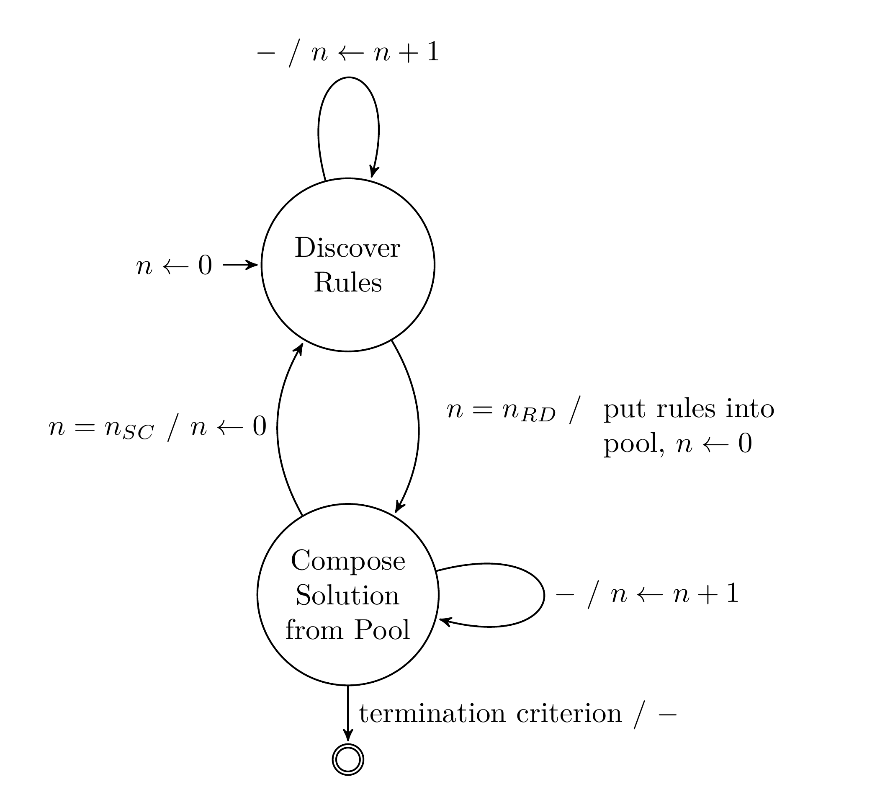
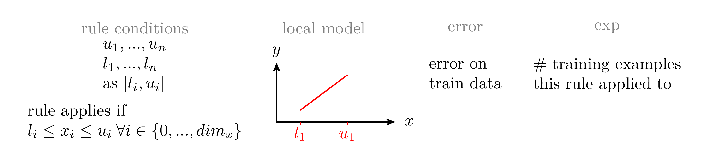
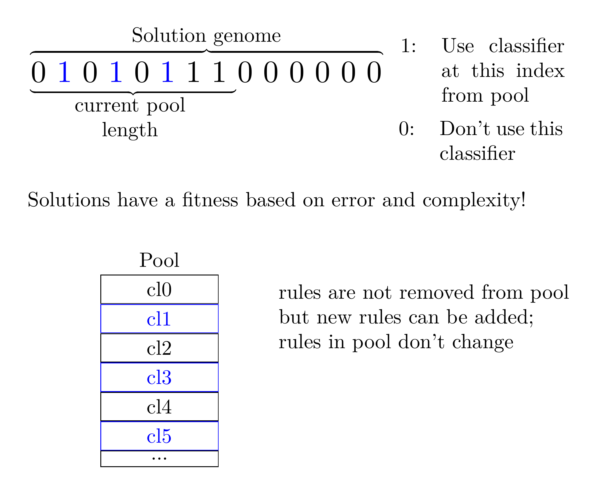

# SupRB

## What is SupRB?

SupRB is a rule-set learning algorithm (or Learning Classifier System (LCS)) that utilises two separate optimizers that discover new rules and create global solutions to the learning problem, respectively. Those rules are stored in a Pool that expands during runtime and provides rules for solution creation.

<!---

-->

Rules use interval bounds for matching and a simple local model for outputs.

Solutions of the problem select classifiers from the unchanging pool.

## Publications

### The Concept

Michael Heider, Helena Stegherr, Jonathan Wurth, Roman Sraj, and Jörg Hähner. 2022. **Separating Rule Discovery and Global Solution Composition in a Learning Classifier System.** In Genetic and Evolutionary Computation Conference Companion (GECCO ’22 Companion). https://doi.org/10.1145/3520304.3529014 https://arxiv.org/abs/2202.01677

### Comparisons with other Systems

Michael Heider, Helena Stegherr, Jonathan Wurth, Roman Sraj, and Jörg Hähner. 2022. **Investigating the Impact of Independent Rule Fitnesses in a Learning Classifier System.** https://arxiv.org/abs/2207.02300

### Investigating Components

Jonathan Wurth, Michael Heider, Helena Stegherr, Roman Sraj, and Jörg Hähner. 2022. **Comparing different Metaheuristics for Model Selection in a Supervised Learning Classifier System.** In Genetic and Evolutionary Computation Conference Companion (GECCO ’22 Companion). https://doi.org/10.1145/3520304.3529015

### Explainability of LCS

Michael Heider, Helena Stegherr, Richard Nordsieck, Jörg Hähner. Learning Classifier Systems for Self-explaining Socio-Technical-Systems." arXiv preprint arXiv:2207.02300 (2022).

## Experiments

We provide the experiment scripts used in associated publications under: https://github.com/heidmic/suprb-experimentation

## Install all requirements

    pip3 install -r requirements.txt

Tested with Python 3.9.4.

## Contributing

Newly created branch should follow a pattern that allows easy comprehension of what is being done and why, e.g.:

**<Issue_number>\_<short_description_of_PR>**, e.g. *issue_3_introduce_volume_for_rule_discovery*.

If there is no open issue the branch name should just reflect a short description of the feature/fix, e.g. *introduce_volume_for_rule_discovery*.

The commit messages of all the commits in your PR should be properly formatted:
- The first line is the commit message's *summary line*.
- The summary line starts with a *capitalized imperative* (e.g. “Add …”, “Fix
  …”, “Merge …”).
- The summary line is just one line (aim for 50 characters or less).
- The summary line is a heading—it *doesn't* end with a period!
- If more text follows (which will often be the case) there *must* be one blank
  line after the summary line.
- All lines after the summary line (the commit message's *body*) should be
  wrapped at around 72 characters.  Remember to leave a blank line after the
  summary line.
- Use the message body for more detailed explanations if necessary. Don't put
  these in the summary line.
- The body may contain multiple paragraphs, separated by *blank lines*.
- The body may contain bullet lists.
- Basically, adhere to
  [this](https://tbaggery.com/2008/04/19/a-note-about-git-commit-messages.html).

Avoid merge commits by using rebase rather than merge when combining branches
