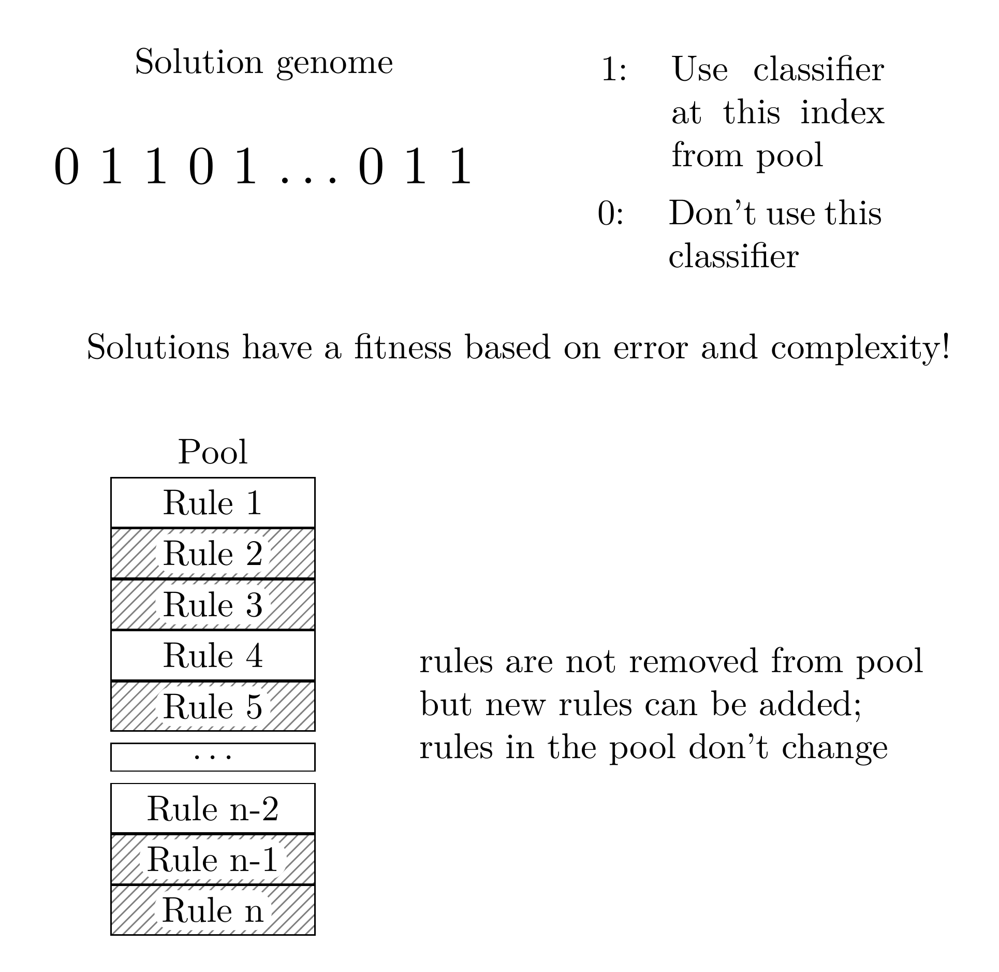

# SupRB-2

## What is SupRB-2?

SupRB-2 is a Learning Classifier System (LCS) that utilises two separate optimizers that discover new rules and create global solutions to the learning problem, respectively. Those rules are stored in a Pool that expands during runtime and provides rules for solution creation.


Classifiers or Rules use interval bounds for matching and a simple local model for outputs.


Solutions of the problem select classifiers from the unchanging pool.




## Install all requirements


    pip3 install -r suprb2/requirements.txt


Tested with Python 3.8.5 and Python 3.7.3.


## Contributing

A newly created branch must follow the following convention:

**<affiliation>_<Issue_number>\_<short_description_of_PR>**

e.g. oc_3_introduce_volume_for_rule_discovery


The commit messages of all the commits in your PR should be properly formatted:
- The first line is the commit message's *summary line*.
- The summary line starts with a *capitalized imperative* (e.g. “Add …”, “Fix
  …”, “Merge …”).
- The summary line is just one line (aim for 50 characters or less).
- The summary line is a heading—it *doesn't* end with a period!
- If more text follows (which will often be the case) there *must* be one blank
  line after the summary line.
- All lines after the summary line (the commit message's *body*) should be
  wrapped at around 72 characters.  Remember to leave a blank line after the
  summary line.
- Use the message body for more detailed explanations if necessary. Don't put
  these in the summary line.
- The body may contain multiple paragraphs, separated by *blank lines*.
- The body may contain bullet lists.
- Basically, adhere to
  [this](https://tbaggery.com/2008/04/19/a-note-about-git-commit-messages.html).

Avoid merge commits by using rebase rather than merge when combining branches

## Testing

We use `unittest` to test our application and `coverage` to extract the results.
`unittest` is a default library from python, there is no need to install it.
`coverage` can be installed via pip.

To run the tests, use the following program
```bash
coverage run -m --source=suprb2 unittest discover
````

And to view the coverage run:
```bash
coverage report
```
or
```bash
coverage html
open htmlcov/index.html
```
for a nicer presentation.
